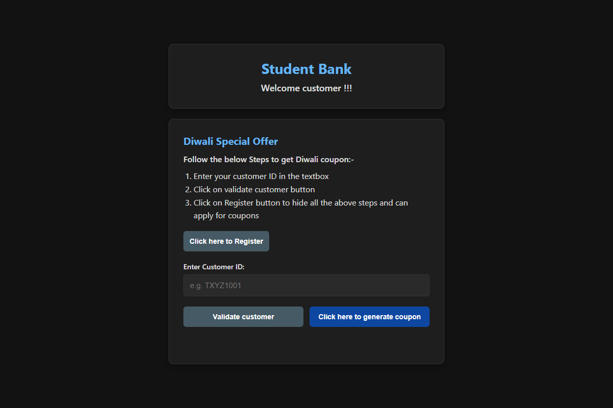
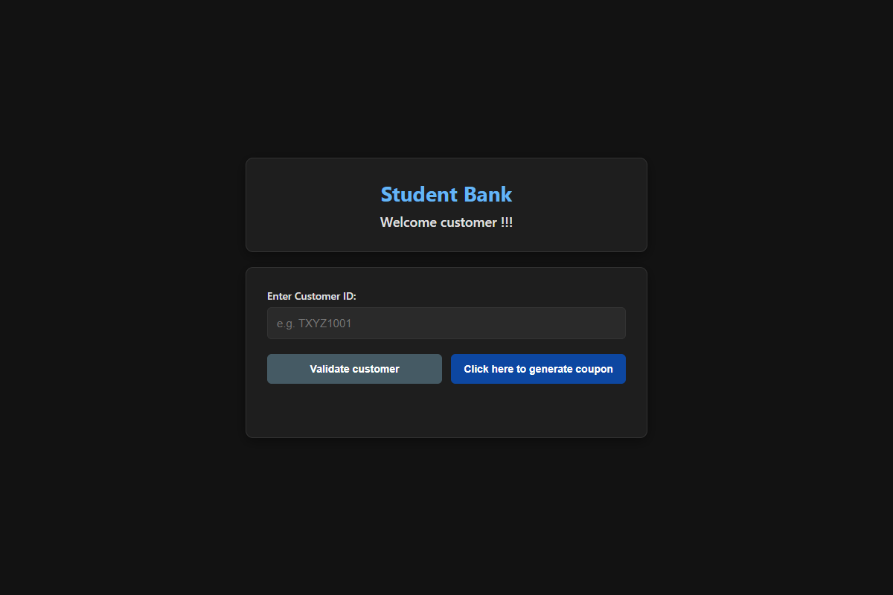
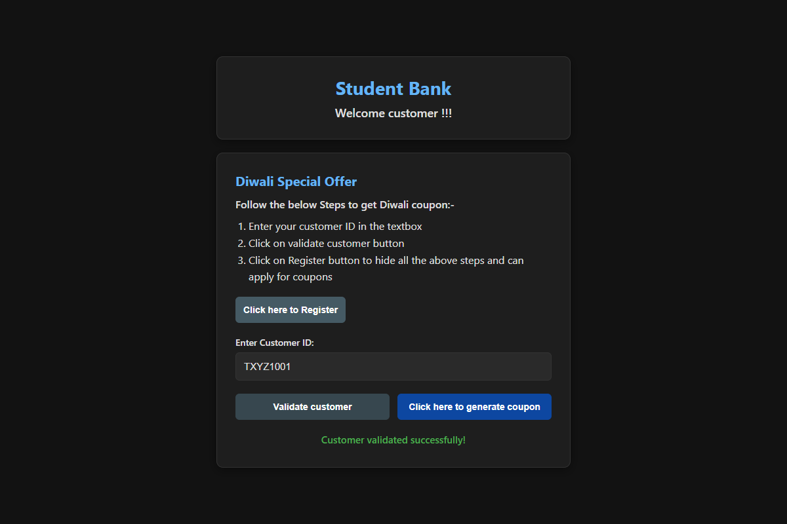
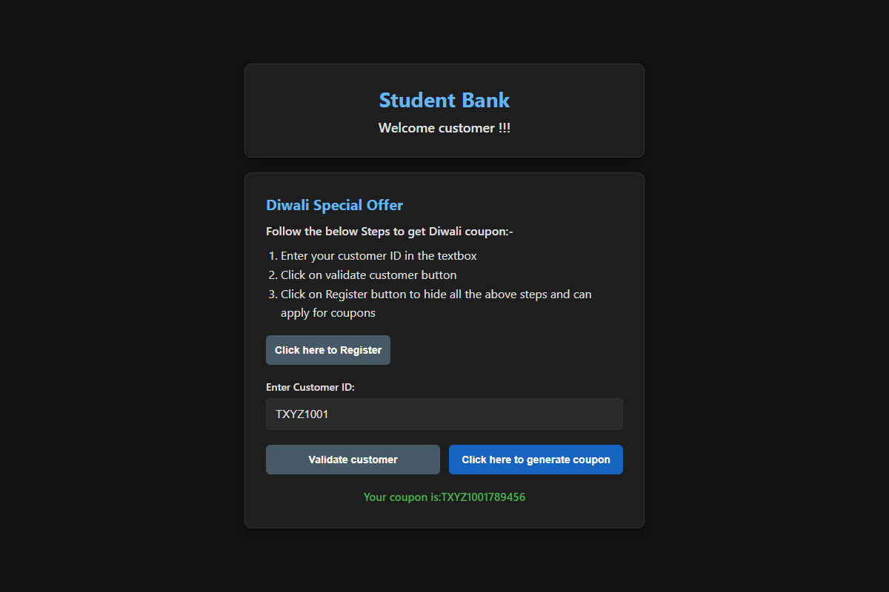

# Week 1: JavaScript Case Study - Student Bank Customer Page

**Author:** Ujjwal Pandey (GitHub: code-withujjwal)

This project is a case study implementation of "Student Bank", based on the Infosys Springboard course "Bank Customer Page using JavaScript".

## Source Code
The web application files are located in the `Source-Code` directory:
- [index.html](./Source-Code/index.html)
- [style.css](./Source-Code/style.css)
- [script.js](./Source-Code/script.js)

## Application Screenshots
The following screenshots demonstrate the functionality of the Student Bank page:

1. **Homepage / Initial State**
   

2. **Registration Steps Hidden**
   

3. **Customer Validation**
   

4. **Coupon Generation**
   

## Course Completion Certificate
- [Certificate PDF](./Certificate/EPAM_Week1_Certificate.pdf)
- [Certificate Image](./Certificate/EPAM_Week1_Certificate_Screenshot.png)
